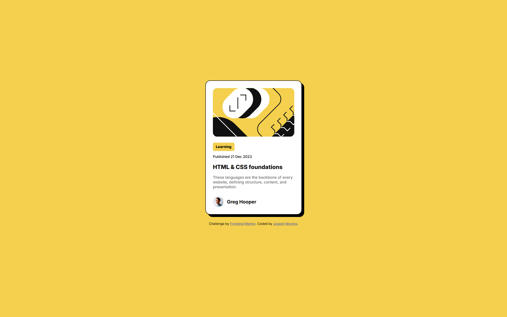

# Frontend Mentor - Blog preview card solution

This is a solution to the [Blog preview card challenge on Frontend Mentor](https://www.frontendmentor.io/challenges/blog-preview-card-ckPaj01IcS). Frontend Mentor challenges help you improve your coding skills by building realistic projects. 

## Table of contents

- [Overview](#overview)
  - [Screenshot](#screenshot)
  - [Links](#links)
- [My process](#my-process)
  - [Built with](#built-with)
  - [What I learned](#what-i-learned)
  - [Useful resources](#useful-resources)

## Overview

Blog preview card made with HTML and CSS

### Screenshot

### Links

- [https://www.frontendmentor.io/solutions/blog-preview-card-XmO5r46oCS](Solution URL)
- [https://josephmoreno.github.io/blog-preview-card/](Live Site URL)

## My process

Structured the HTML first; the card is its own div that contains two more divs: one for the QR code, the other for the text.

Started styling:
1. Make div containing the card span the viewport's height (approximately, 95vh)
2. Center the card vertically and horizontally in said div
3. Imported and used font in the body
4. Adjusted finer details: font size, font weight, color, border-radius

### Built with

- Semantic HTML5 markup
- Mobile-first workflow

### What I learned

Can justify content horizontally center with justify-items or "margin-inline: auto"; still figuring out when to use which one.

### Useful resources

- [CSS justify-items](https://developer.mozilla.org/en-US/docs/Web/CSS/justify-items) - Justified the card horizontally center
- [CSS align-content](https://developer.mozilla.org/en-US/docs/Web/CSS/align-content) - Aligned the card vertically center
- [Kevin Powell - "A practical guide to responsive web design"](https://youtu.be/x4u1yp3Msao?si=5OnjBxHq-lpHTtjo&t=428) - margin-inline: auto;
