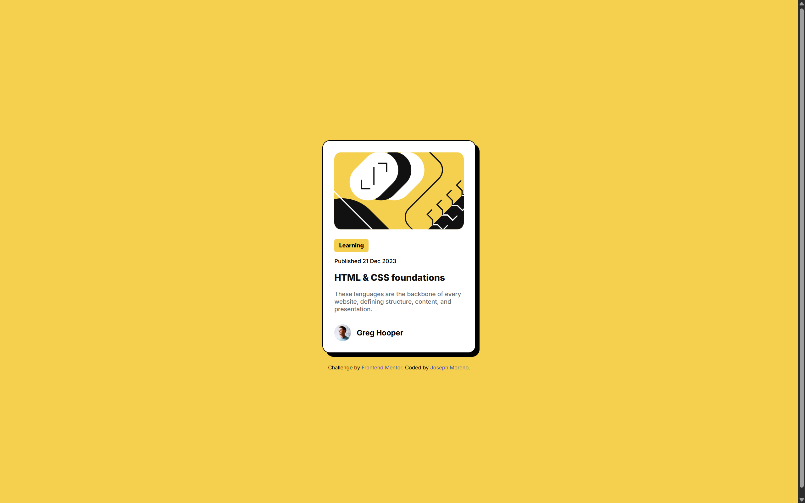

# Frontend Mentor - Blog preview card solution

This is a solution to the [Blog preview card challenge on Frontend Mentor](https://www.frontendmentor.io/challenges/blog-preview-card-ckPaj01IcS). Frontend Mentor challenges help you improve your coding skills by building realistic projects. 

## Table of contents

- [Overview](#overview)
  - [Screenshot](#screenshot)
  - [Links](#links)
- [My process](#my-process)
  - [Built with](#built-with)
  - [What I learned](#what-i-learned)
  - [Useful resources](#useful-resources)

## Overview

Blog preview card made with HTML and CSS

### Screenshot

### Links

- [Solution URL](https://www.frontendmentor.io/solutions/blog-preview-card-XmO5r46oCS)
- [Live Site URL](https://josephmoreno.github.io/blog-preview-card/)

## My process

Structured the HTML first; the card is its own div that contains multiple block elements: the image, the "status", publish date, title, the summary text, and the profile image + publisher name is a single div.

HTML structure and styling between mobile and desktop version don't change.

Started styling:
1. Make body containing the card span the viewport's height (approximately, 95vh)
2. Center the card vertically (align-content on body) and horizontally ("margin-inline: auto;" on the card)
3. Imported and used font in the body
4. Adjusted finer details: font size, font weight, color, border-radius, background colors

### Built with

- Semantic HTML5 markup
- Mobile-first workflow

### What I learned

:hover pseudo-class to change text color. 

### Useful resources

- [:hover pseudo-class](https://developer.mozilla.org/en-US/docs/Web/CSS/:hover) - Card title's text color changed with :hover
- [CSS pseudo-classes](https://developer.mozilla.org/en-US/docs/Web/CSS/Pseudo-classes)
